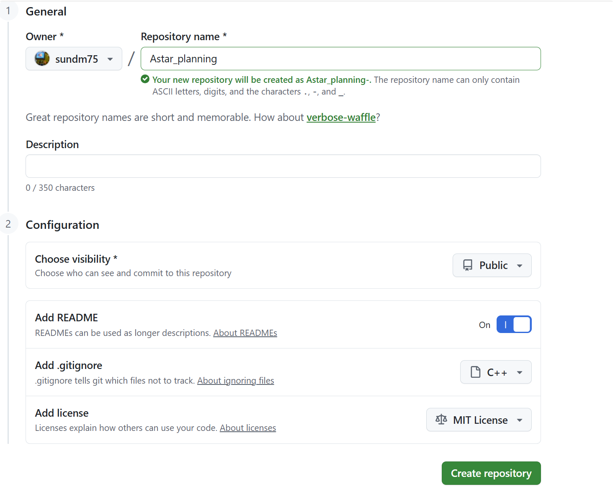
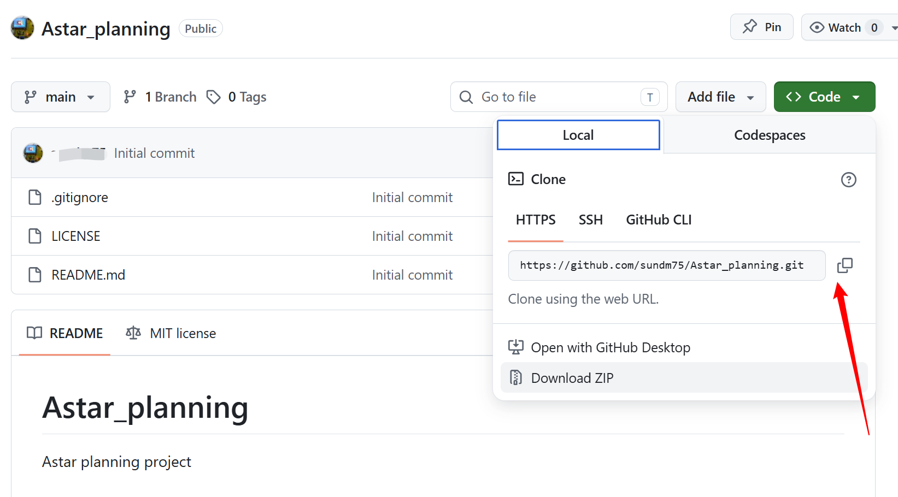
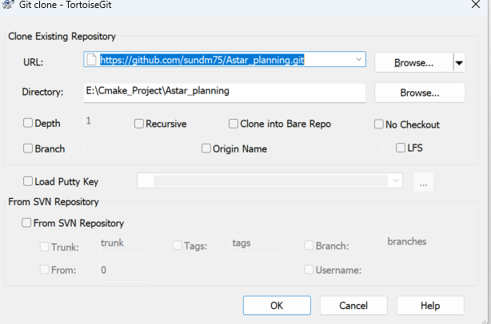
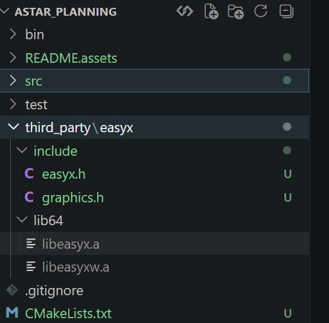

# Astar_planning
Astar planning project

# 1、远程工程建立并clone到本地 

在git上新建一个工程 

 Create a new repository  -> Astar_planning, 



建立 成功后，复制 https  网址，



再到本地 clone下来



# 2、创建工程框架

按照 CMAKE_PLANNING_DEMO 走一遍

```
E:\CMAKE_PROJECT\ASTAR_PLANNING\ASTAR_PLANNING
│  .gitignore
│  CMakeLists.txt
│  LICENSE
│  README.md
│  
├─bin
│      Astar_main.exe
│      libgrid_map.dll
│      libstrategy.dll
│      
├─README.assets
│      image-20260615143536710.png
│      image-20260615143623937.png
│      QQ_1781505217342.png
│      
├─src
│  │  CMakeLists.txt
│  │  main.cpp
│  │  main.h
│  │  
│  ├─grid_map
│  │      CMakeLists.txt
│  │      config.h
│  │      grid_map.cpp
│  │      grid_map.h
│  │      
│  └─strategy
│          CMakeLists.txt
│          strategy.cpp
│          strategy.h
│          
├─test
└─third_party
```

下面添加 easyx 动态库， 将  库文件复制到 third_party目录下



在 用到easyx 的代码中对应的 cmake 中加动态库  

```
# 添加头文件路径
target_include_directories(${PROJECT_NAME}
    PUBLIC
    ${CMAKE_SOURCE_DIR}/third_party/easyx/include
)  

# 添加库路径
target_link_directories(${PROJECT_NAME}
    PUBLIC
    ${CMAKE_SOURCE_DIR}/third_party/easyx/lib64
)
# 添加库
target_link_libraries(${PROJECT_NAME}
    PUBLIC
    easyx
)
```

工程中 main.c   grid_map.c 中用到了 easyx ,则在 这两文件对应的 CMakeLists.txt 添加以上代码

测试，在main.c中添加以下，则画了2个圆

```
    #include <graphics.h>
    
    initgraph(1000, 1000);
    setbkcolor(WHITE);
    cleardevice();

    std::cout<<"draw circles: "<<std:: endl;
    setlinecolor(BLACK);
    setlinestyle(PS_SOLID, 4);
    circle(500, 500, 400);
    circle(500, 500, 300);
    
    system("pause   ");
```

